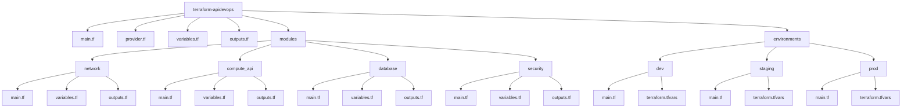

# Estructura Terraform Modular - APIDevOps

## Arbol de carpetas

terraform/
├── main.tf
├── variables.tf
├── outputs.tf
├── provider.tf
├── modules/
│ ├── network/
│ │ ├── main.tf
│ │ ├── variables.tf
│ │ └── outputs.tf
│ ├── compute_api/
│ │ ├── main.tf
│ │ ├── variables.tf
│ │ └── outputs.tf
│ ├── database/
│ │ ├── main.tf
│ │ ├── variables.tf
│ │ └── outputs.tf
│ ├── monitoring/
│ │ ├── main.tf
│ │ ├── variables.tf
│ │ └── outputs.tf
│ └── security/
│ ├── main.tf
│ ├── variables.tf
│ └── outputs.tf
└── environments/
├── dev/
│ ├── main.tf
│ └── terraform.tfvars
├── staging/
│ ├── main.tf
│ └── terraform.tfvars
└── prod/
├── main.tf
└── terraform.tfvars

## Diagrama Mermaid (para exportar o capturar como imagen)

